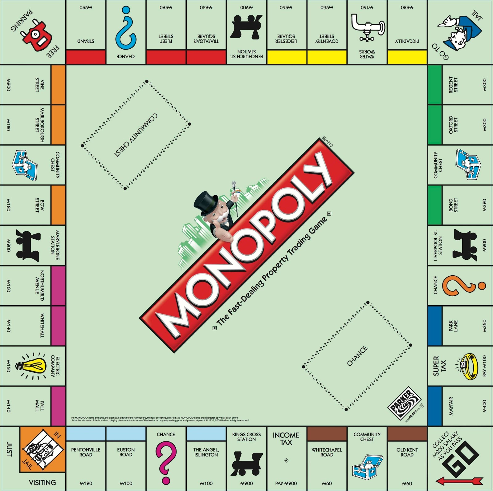

# Monopoly (level 3)

{:.inline}{: style="width:50%"}

Every bank, insurance company and the CPB draw up models that aim to describe our economy. All aspects that are of influence are factored in and subsequently simulated in numerous different scenarios by a computer, just to be able to better assess risk in specific events or effects of new measures. 

Because of dependencies between parameters of such models it quickly becomes impossible to calculate them by hand. Especially when the effect of a measure has a random component. With the use of a computer it is much faster to model this and you can even find settings that help you optimize: you can maximize profits, but also minimize chances of going bankrupt. Or perhaps a mix of both.

In this module we'll calculate a simple example: Monopoly with two players, in which we gradually increase the complexity. For those with a knack for it and already dreams of a career in the risk-analysis division of JP Morgan we've added some suggestions for extra assignments.

Two things to be aware of before starting with this assignment:

1. To figure out whether your code works, you'll have to `print` often. Very useful, because it allows you to verify the logic in each step of the program you implement and whether it works the way you envisioned. Once you're convinced a step functions the way it's supposed to, you can remove the `print` statement. Which you should, because `print`ing is a computationally slow action and quickly becomes cluttering when done in abundance.

2. This module works toward a fairly complex simulation of Monopoly. To make sure you understand your own code completely it is important to start out straightforward and iteratively add new components or layers of complexity to your program. To retain a working copy of each part of the assignment we'll ask you to save each part as a separate file, since each part often is an expansion of previous code.
